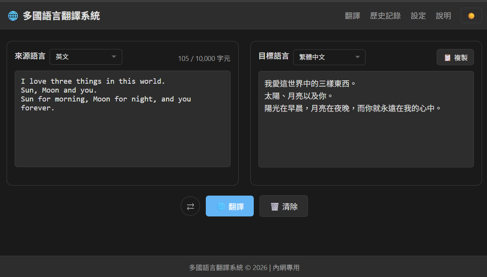
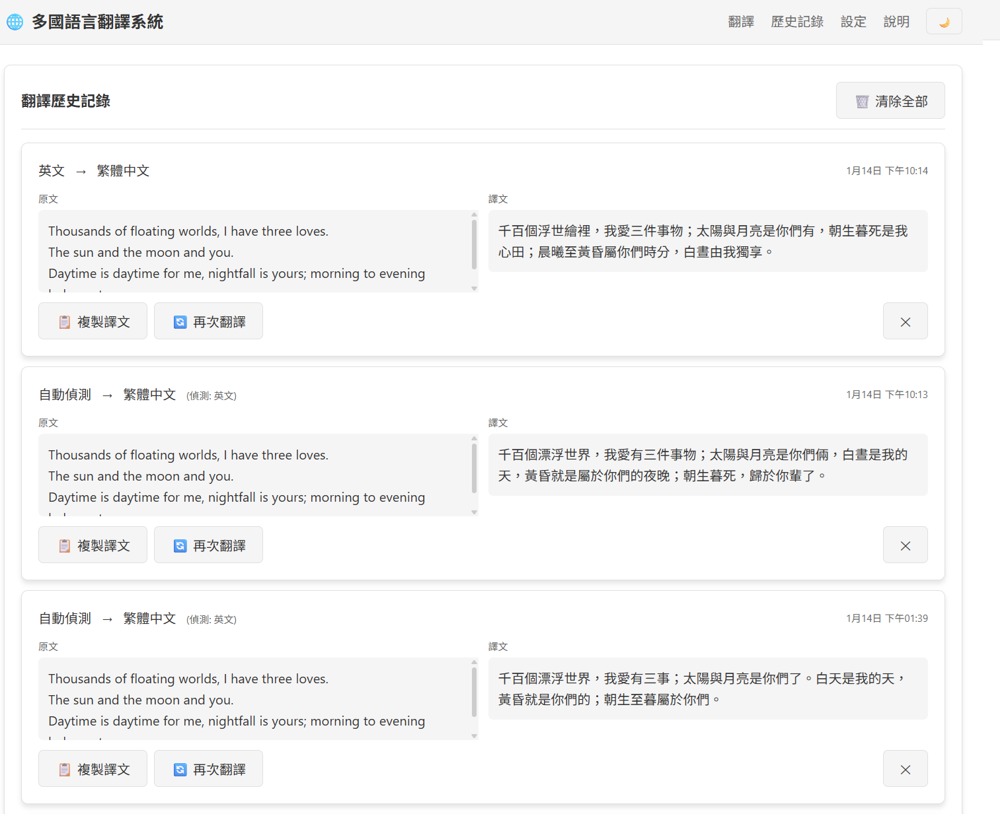
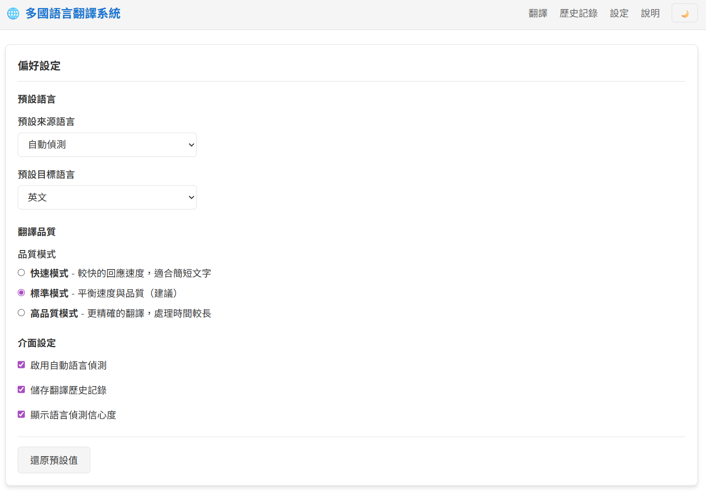

# 多國語言翻譯系統

基於 TAIDE-LX-7B 大型語言模型的多國語言翻譯系統，採用 Django ASGI + HTMX + Alpine.js 技術架構，提供即時翻譯、歷史記錄、使用者設定等功能。

## 功能特點

- 🌐 **多語言支援**：支援繁體中文、簡體中文、英文、日文、韓文、越南文、泰文、印尼文等 8 種語言
- 🔄 **自動語言偵測**：智慧偵測輸入文字的來源語言
- ⚡ **即時翻譯**：低延遲翻譯回應，支援 GPU 加速
- 📝 **翻譯歷史**：瀏覽器本地儲存，保留最近 20 筆翻譯記錄
- ⚙️ **個人化設定**：支援深色/淺色主題、字體大小調整
- 📊 **系統監控**：即時查看系統資源使用狀況和翻譯統計

## 系統需求

### 硬體需求

| 項目   | 最低需求 | 建議配置                |
| ------ | -------- | ----------------------- |
| CPU    | 4 核心   | 8 核心以上              |
| 記憶體 | 16 GB    | 32 GB 以上              |
| GPU    | -        | NVIDIA GPU (16GB+ VRAM) |
| 磁碟   | 50 GB    | 100 GB SSD              |

### 軟體需求

- Python 3.11（推薦；Windows 上務必使用 3.11 以確保 PyTorch cu118 相容性，但若系統有 3.10 也可以）
- CUDA 11.8+（GPU 加速時需要）
- Git

## 快速開始

### 1. 複製專案

```bash
git clone <repository-url>
cd MutilLanguageTranslate
```

### 2. 建立虛擬環境

```bash
python -m venv venv

# Windows
venv\Scripts\activate

# Linux/macOS
source venv/bin/activate
```

### 3. 安裝相依套件

#### CPU 模式（或已安裝 PyTorch）

```bash
pip install -r requirements.txt
```

#### GPU 模式（NVIDIA CUDA）

**重要：** 請使用 Python 3.10 或 3.11（PyTorch cu118 wheel 支援這些版本）。

```powershell
# 升級 pip
pip install --upgrade pip

# 1. 安裝 PyTorch with CUDA 11.8
pip install --index-url https://download.pytorch.org/whl/cu118 torch torchvision

# 2. 安裝專案相依套件
pip install -r requirements.txt

# 3. (可選) 安裝 bitsandbytes 以啟用 4-bit 量化（適用於 8GB VRAM 以下的 GPU）
# Windows 上可能需要 Visual Studio Build Tools
pip install bitsandbytes
```

**疑難排解：**
- 若 Python 版本為 3.14 等較新版本，PyTorch 官方 wheel 可能尚未支援，請使用 `py -3.10` 或 `py -3.11` 建立虛擬環境。
- bitsandbytes 在 Windows 上可能需要編譯工具，若安裝失敗可跳過（系統會自動使用 float16 模式）。

### 4. 設定配置檔

```bash
# 複製範例配置檔
cp config/app_config.yaml.example config/app_config.yaml
cp config/model_config.yaml.example config/model_config.yaml

# 依據需求編輯配置檔
```

### 5. 下載模型

模型會在首次啟動時自動下載，或可手動下載：

```bash
# 模型將儲存於 models/ 目錄
python -c "from transformers import AutoModelForCausalLM; AutoModelForCausalLM.from_pretrained('taide/TAIDE-LX-7B', cache_dir='./models')"
```

### 6. 啟動服務

```bash
cd translation_project

# 開發模式
..\.venv\Scripts\python manage.py runserver

# 生產模式（使用 uvicorn）
uvicorn translation_project.asgi:application --host 0.0.0.0 --port 8000
```

### 7. 開啟瀏覽器

造訪 http://localhost:8000 開始使用翻譯服務。

## GPU 記憶體最佳化（自動偵測）

系統會**自動偵測** GPU 記憶體大小並選擇最佳載入模式：

- **VRAM ≤ 12GB**（例如 RTX 4060 8GB, RTX 3060 12GB）：自動啟用 **4-bit 量化**，節省 70-75% 記憶體
- **VRAM > 12GB**（例如 RTX 4090 24GB）：使用 **float16 模式**，保持最佳品質

無需手動設定，系統會自動選擇最適合的模式。

### 手動視盖自動偵測（可選）

若您想強制使用特定模式，可修改 `config/model_config.yaml`：

```yaml
# 強制啟用 4-bit 量化（忽略自動偵測）
quantization:
  enable_4bit: true
  load_in_4bit: true

# 或強制停用 4-bit 量化（使用 float16）
quantization:
  enable_4bit: false
```

### bitsandbytes 安裝說明

4-bit 量化需要 `bitsandbytes` 套件（已包含在 `requirements.txt` 中）：

- **Linux**: 直接安裝即可
- **Windows**: 可能需要 [Visual Studio Build Tools](https://visualstudio.microsoft.com/downloads/#build-tools-for-visual-studio-2022)（C++ 開發工具）

若 bitsandbytes 安裝失敗或不可用，系統會自動退回使用 float16 模式。

### 方法 2：CPU/GPU Offload（accelerate）

使用 `accelerate` 將模型部分層移至 CPU 或磁碟，以適配 GPU 記憶體限制。

```powershell
# accelerate 已在 requirements.txt 中，確認已安裝
pip install accelerate
```

`config/model_config.yaml` 中設定 `max_gpu_memory` 為您的 VRAM 大小：

```yaml
model:
  max_gpu_memory: 8  # 8GB VRAM
```

系統會自動使用 `device_map="auto"` 將模型層分配到 GPU/CPU/磁碟。

### 測試設定

您可以使用內建的測試 API 驗證設定是否正確：

```powershell
# 測試載入小模型（gpt2）以驗證 GPU 與量化設定
curl -X POST http://localhost:8000/api/v1/admin/model/test/ -H "Content-Type: application/json" -d '{"model_name": "gpt2"}'
```

或使用我們提供的測試腳本：

```powershell
.venv\Scripts\python tests\quick_model_test.py
```

### 7. 開啟瀏覽器

造訪 http://localhost:8000 開始使用翻譯服務。

## 容器部署（Podman / Docker / Compose）

> 驗證重點：服務啟動後 `GET /api/health/` 需回 200。

### 使用 Podman

```bash
# 建置映像
podman build -t translation-service -f Containerfile .

# 執行容器
podman run -d \
  --name translation-service \
  -p 8000:8000 \
  -v ./models:/app/models:ro \
  -v ./config:/app/config:ro \
  -v ./logs:/app/logs \
  translation-service
```

### 使用 Docker

```bash
docker build -t translation-service -f Containerfile .

docker run -d \
  --name translation-service \
  -p 8000:8000 \
  -v ./models:/app/models:ro \
  -v ./config:/app/config:ro \
  -v ./logs:/app/logs \
  translation-service
```

### 使用 Docker Compose

```bash
docker compose -f docker-compose.yaml up -d
```

### 健康檢查

```bash
curl -f http://localhost:8000/api/health/
```

## 目錄結構

```
MutilLanguageTranslate/
├── config/                          # 配置檔目錄
│   ├── app_config.yaml              # 應用程式配置
│   ├── model_config.yaml            # 模型配置
│   └── languages.yaml               # 語言定義
├── logs/                            # 日誌目錄
├── models/                          # 模型目錄
│   ├── TAIDE-LX-7B-Chat/            # 模型名稱一
│   └── Llama-3.1-TAIDE-LX-8B-Chat/  # 模型名稱一
├── translation_project/             # Django 專案
│   ├── translation_project/         # 專案設定
│   │   ├── settings.py
│   │   ├── urls.py
│   │   └── asgi.py
│   └── translator/                  # 翻譯應用程式
│       ├── api/                     # REST API
│       ├── services/                # 服務層
│       ├── templates/               # 前端模板
│       ├── static/                  # 靜態資源
│       └── utils/                   # 工具函數
├── specs/                           # 規格文件
├── tests/                           # 測試
├── Containerfile                    # 容器建置檔
├── docker-compose.yaml              # Docker Compose
├── requirements.txt                 # Python 相依套件
└── README.md                        # 本文件
```

## API 文件

### 翻譯 API

#### POST /api/v1/translate/

執行文字翻譯。

**請求**
```json
{
  "text": "要翻譯的文字",
  "source_language": "auto",
  "target_language": "en",
  "quality": "standard"
}
```

**回應**
```json
{
  "request_id": "uuid",
  "status": "completed",
  "translated_text": "Translated text",
  "processing_time_ms": 1234.56,
  "detected_language": "zh-TW"
}
```

### 健康檢查 API

#### GET /api/health/

回傳系統健康狀態。

#### GET /api/ready/

就緒探針，檢查服務是否準備好接收流量。

#### GET /api/live/

存活探針，檢查服務是否存活。

### 語言 API

#### GET /api/v1/languages/

取得支援的語言清單。

### 管理 API

#### POST /api/v1/admin/model/test/

測試載入小型模型（用於驗證環境與量化設定）。

**請求**
```json
{
  "model_name": "gpt2"
}
```

**回應**
```json
{
  "success": true,
  "message": "小模型載入與推論成功 (gpt2)",
  "model_info": {
    "model_name": "gpt2",
    "generated": "Hello world, I'm not sure what to say",
    "cuda_available": true,
    "cuda_device_count": 1
  }
}
```

## 配置說明

### app_config.yaml

```yaml
server:
  host: "0.0.0.0"
  port: 8000
  workers: 1

translation:
  default_source_language: "auto"
  default_target_language: "en"
  max_text_length: 5000
  timeout_seconds: 120

security:
  admin_ip_whitelist:
    - "127.0.0.1"
    - "::1"
```

### model_config.yaml

```yaml
model:
  name: "taide/TAIDE-LX-7B"
  cache_dir: "./models"
  device: "auto"  # auto, cuda, cpu
  torch_dtype: "auto"

inference:
  max_new_tokens: 2048
  temperature: 0.7
  top_p: 0.9
```

## 界面範例





## 授權

MIT License

## 貢獻

歡迎提交 Issue 和 Pull Request！

## 聯絡

如有問題，請透過 GitHub Issues 聯絡我們。
